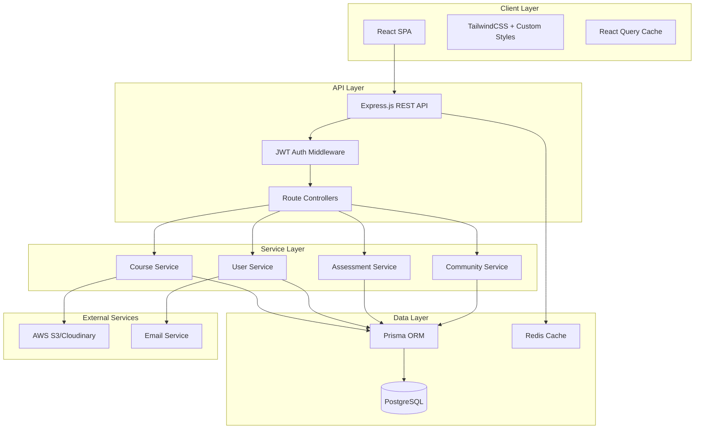

# Design Document

## Overview

SoloSuccess Intel Academy is a full-stack web application built with modern technologies to deliver a premium learning experience for female entrepreneurs. The platform combines a React-based frontend with a Node.js backend, PostgreSQL database, and cloud storage for media assets. The design emphasizes the unique "Girl Boss Drill Sergeant" aesthetic through custom CSS implementations of glassmorphism, holographic effects, and girly camouflage patterns.

### Technology Stack

**Frontend:**
- React 18+ with TypeScript for type safety and component architecture
- Vite for fast development and optimized production builds
- TailwindCSS for utility-first styling with custom theme extensions
- Framer Motion for animations and transitions
- React Router v6 for client-side routing
- React Query for server state management and caching
- Zustand for client-side state management

**Backend:**
- Node.js with Express.js for RESTful API
- TypeScript for type-safe backend code
- PostgreSQL for relational data storage
- Prisma ORM for database access and migrations
- JWT for authentication and authorization
- YouTube API for video embedding and metadata
- AWS S3 or Cloudinary for document/resource storage only
- Redis for session management and caching

**Development & Deployment:**
- Docker for containerization
- GitHub Actions for CI/CD
- Vercel or Netlify for frontend hosting
- Railway or Render for backend hosting
- PostgreSQL managed service (Supabase or Railway)


## Architecture

### System Architecture Diagram



### Application Structure

**Frontend Structure:**
```
src/
├── components/
│   ├── common/           # Reusable UI components
│   │   ├── Button.tsx
│   │   ├── Card.tsx
│   │   ├── GlassmorphicCard.tsx
│   │   └── HolographicBadge.tsx
│   ├── layout/           # Layout components
│   │   ├── Header.tsx
│   │   ├── Navigation.tsx
│   │   └── Footer.tsx
│   ├── course/           # Course-related components
│   ├── dashboard/        # Dashboard components
│   ├── community/        # Community components
│   └── profile/          # Profile components
├── pages/                # Page components
│   ├── HomePage.tsx
│   ├── DashboardPage.tsx
│   ├── CoursePage.tsx
│   └── ProfilePage.tsx
├── hooks/                # Custom React hooks
├── services/             # API service functions
├── store/                # Zustand state stores
├── styles/               # Global styles and theme
│   ├── glassmorphism.css
│   ├── holographic.css
│   └── camo-patterns.css
├── types/                # TypeScript type definitions
└── utils/                # Utility functions
```

**Backend Structure:**
```
src/
├── controllers/          # Route controllers
│   ├── authController.ts
│   ├── courseController.ts
│   ├── userController.ts
│   └── assessmentController.ts
├── services/             # Business logic
│   ├── courseService.ts
│   ├── userService.ts
│   └── assessmentService.ts
├── middleware/           # Express middleware
│   ├── auth.ts
│   ├── errorHandler.ts
│   └── validation.ts
├── models/               # Prisma schema and types
├── routes/               # API routes
├── utils/                # Utility functions
└── config/               # Configuration files
```


## Components and Interfaces

### Core UI Components

#### GlassmorphicCard Component
A reusable card component implementing the glassmorphism design pattern with frosted transparency, depth, and shadows.

**Props Interface:**
```typescript
interface GlassmorphicCardProps {
  children: React.ReactNode;
  variant?: 'default' | 'elevated' | 'flat';
  className?: string;
  onClick?: () => void;
  holographicBorder?: boolean;
  camoBackground?: boolean;
}
```

**Styling Approach:**
- Uses CSS backdrop-filter for frosted glass effect
- Layered box-shadows for depth perception
- Semi-transparent background with blur
- Optional holographic border gradient animation
- Optional camo pattern overlay

#### HolographicButton Component
Interactive button with holographic rainbow shimmer effects on hover.

**Props Interface:**
```typescript
interface HolographicButtonProps {
  children: React.ReactNode;
  variant?: 'primary' | 'secondary' | 'outline';
  size?: 'sm' | 'md' | 'lg';
  onClick?: () => void;
  disabled?: boolean;
  loading?: boolean;
}
```

**Styling Features:**
- Gradient animation using cyan, magenta, yellow
- Glossy surface with reflection effects
- Smooth hover transitions with scale transform
- Loading state with animated shimmer
- Disabled state with reduced opacity

#### ProgressTracker Component
Visual progress indicator with holographic effects and glassmorphic styling.

**Props Interface:**
```typescript
interface ProgressTrackerProps {
  current: number;
  total: number;
  label?: string;
  showPercentage?: boolean;
  holographicEffect?: boolean;
}
```


#### CamoBackground Component
Generates girly camouflage patterns using pink, black, and grey colors.

**Props Interface:**
```typescript
interface CamoBackgroundProps {
  variant?: 'subtle' | 'bold' | 'animated';
  opacity?: number;
  className?: string;
}
```

**Implementation:**
- SVG-based camo pattern generation
- CSS mask for pattern application
- Multiple pattern variations
- Optional animation for dynamic effect

#### AchievementBadge Component
Displays holographic achievement badges with unlock animations.

**Props Interface:**
```typescript
interface AchievementBadgeProps {
  title: string;
  description: string;
  icon: string;
  unlocked: boolean;
  unlockedDate?: Date;
  rarity?: 'common' | 'rare' | 'epic' | 'legendary';
}
```

### Page Components

#### HomePage
Landing page with hero section, features, pricing, and testimonials.

**Key Sections:**
- Hero with CTA and character illustration
- Feature cards in glassmorphic grid
- Pricing tiers with holographic borders
- Success stories carousel
- Footer with links and social media

#### DashboardPage
Student portal showing courses, progress, and quick actions.

**Key Sections:**
- Navigation with glassmorphic tabs
- Course progress cards grid
- Achievement showcase
- Recent activity feed
- Quick action buttons

#### CoursePage
Individual course view with lessons, resources, and progress.

**Key Sections:**
- Course hero with glassmorphic overlay
- Module accordion with lessons
- Video player with custom controls
- Note-taking panel
- Resource downloads section

#### LessonPage
Lesson content delivery with video, notes, and assessments.

**Key Sections:**
- Video player with glassmorphic controls
- Lesson content area
- Interactive note-taking panel
- Progress indicator
- Next lesson navigation


### API Endpoints

#### Authentication Endpoints
```
POST   /api/auth/register          # Register new student
POST   /api/auth/login             # Login student
POST   /api/auth/logout            # Logout student
POST   /api/auth/refresh           # Refresh JWT token
POST   /api/auth/forgot-password   # Request password reset
POST   /api/auth/reset-password    # Reset password with token
```

#### User Endpoints
```
GET    /api/users/me               # Get current user profile
PUT    /api/users/me               # Update user profile
GET    /api/users/me/achievements  # Get user achievements
PUT    /api/users/me/avatar        # Update user avatar
GET    /api/users/me/stats         # Get user statistics
```

#### Course Endpoints
```
GET    /api/courses                # List all courses
GET    /api/courses/:id            # Get course details
GET    /api/courses/:id/modules    # Get course modules
GET    /api/courses/:id/progress   # Get course progress
POST   /api/courses/:id/enroll     # Enroll in course
```

#### Lesson Endpoints
```
GET    /api/lessons/:id            # Get lesson details with activities
GET    /api/lessons/:id/unlock     # Check if lesson is unlocked
GET    /api/lessons/:id/resources  # Get lesson resources
POST   /api/lessons/:id/notes      # Save lesson notes
GET    /api/lessons/:id/notes      # Get lesson notes
```

#### Activity Endpoints
```
GET    /api/activities/:id         # Get activity details
POST   /api/activities/:id/submit  # Submit activity response
GET    /api/activities/:id/unlock  # Check if activity is unlocked
GET    /api/lessons/:lessonId/activities  # Get all activities for a lesson
```

#### Final Project Endpoints
```
GET    /api/courses/:courseId/final-project    # Get final project details
POST   /api/courses/:courseId/final-project/submit  # Submit final project
GET    /api/courses/:courseId/final-project/status  # Get submission status
```

#### Final Exam Endpoints
```
GET    /api/courses/:courseId/final-exam       # Get final exam details
POST   /api/courses/:courseId/final-exam/submit  # Submit final exam
GET    /api/courses/:courseId/final-exam/result  # Get exam result
GET    /api/courses/:courseId/final-exam/unlock  # Check if exam is unlocked
```

#### Progression Endpoints
```
GET    /api/users/me/progression   # Get overall course progression status
GET    /api/courses/:id/can-access # Check if user can access course
POST   /api/courses/:id/unlock-next # Unlock next course after completion
```

#### Certificate Endpoints
```
GET    /api/certificates           # List user certificates
GET    /api/certificates/:id       # Get certificate details
GET    /api/certificates/:id/pdf   # Download certificate PDF
POST   /api/certificates/:id/share # Generate share link
```

#### Community Endpoints
```
GET    /api/community/forums       # List forum categories
GET    /api/community/threads      # List threads
POST   /api/community/threads      # Create new thread
GET    /api/community/threads/:id  # Get thread details
POST   /api/community/threads/:id/replies  # Post reply
GET    /api/community/members      # List members
GET    /api/community/events       # List upcoming events
```


## Data Models

### Database Schema

```prisma
// User Model
model User {
  id            String    @id @default(uuid())
  email         String    @unique
  password      String
  firstName     String
  lastName      String
  avatar        String?
  bio           String?
  createdAt     DateTime  @default(now())
  updatedAt     DateTime  @updatedAt
  
  enrollments   Enrollment[]
  achievements  Achievement[]
  notes         Note[]
  activitySubmissions ActivitySubmission[]
  projectSubmissions FinalProjectSubmission[]
  examResults   FinalExamResult[]
  forumPosts    ForumPost[]
  certificates  Certificate[]
}

// Course Model
model Course {
  id            String    @id @default(uuid())
  courseNumber  Int       @unique // 1-7
  title         String
  description   String
  thumbnail     String
  published     Boolean   @default(false)
  createdAt     DateTime  @default(now())
  updatedAt     DateTime  @updatedAt
  
  lessons       Lesson[]
  finalProject  FinalProject?
  finalExam     FinalExam?
  enrollments   Enrollment[]
  certificates  Certificate[]
}

// Lesson Model
model Lesson {
  id            String    @id @default(uuid())
  courseId      String
  lessonNumber  Int       // 1-12
  title         String
  description   String
  youtubeVideoId String   // YouTube video ID (e.g., "dQw4w9WgXcQ")
  duration      Int       // in seconds (fetched from YouTube API)
  
  course        Course    @relation(fields: [courseId], references: [id])
  activities    Activity[]
  resources     Resource[]
  notes         Note[]
  progress      LessonProgress[]
  
  @@unique([courseId, lessonNumber])
}

// Activity Model
model Activity {
  id            String    @id @default(uuid())
  lessonId      String
  activityNumber Int      // Sequential order within lesson
  title         String
  description   String
  type          String    // quiz, exercise, reflection, practical_task
  content       Json      // Activity-specific content (questions, instructions, etc.)
  required      Boolean   @default(true)
  
  lesson        Lesson    @relation(fields: [lessonId], references: [id])
  submissions   ActivitySubmission[]
  
  @@unique([lessonId, activityNumber])
}

// ActivitySubmission Model
model ActivitySubmission {
  id            String    @id @default(uuid())
  userId        String
  activityId    String
  response      Json      // Student's submission data
  completed     Boolean   @default(false)
  submittedAt   DateTime  @default(now())
  feedback      String?
  
  activity      Activity  @relation(fields: [activityId], references: [id])
  
  @@unique([userId, activityId])
}

// FinalProject Model
model FinalProject {
  id            String    @id @default(uuid())
  courseId      String    @unique
  title         String
  description   String
  instructions  String
  requirements  Json      // Detailed project requirements
  
  course        Course    @relation(fields: [courseId], references: [id])
  submissions   FinalProjectSubmission[]
}

// FinalProjectSubmission Model
model FinalProjectSubmission {
  id            String    @id @default(uuid())
  userId        String
  projectId     String
  submission    Json      // Project files, links, content
  submittedAt   DateTime  @default(now())
  status        String    // pending, approved, needs_revision
  feedback      String?
  
  project       FinalProject @relation(fields: [projectId], references: [id])
  
  @@unique([userId, projectId])
}

// FinalExam Model
model FinalExam {
  id            String    @id @default(uuid())
  courseId      String    @unique
  title         String
  description   String
  timeLimit     Int       // in minutes
  passingScore  Int       // percentage
  
  course        Course    @relation(fields: [courseId], references: [id])
  questions     ExamQuestion[]
  results       FinalExamResult[]
}

// ExamQuestion Model
model ExamQuestion {
  id            String    @id @default(uuid())
  examId        String
  text          String
  type          String    // multiple_choice, true_false, short_answer
  order         Int
  points        Int
  
  exam          FinalExam @relation(fields: [examId], references: [id])
  options       ExamQuestionOption[]
}

// ExamQuestionOption Model
model ExamQuestionOption {
  id            String    @id @default(uuid())
  questionId    String
  text          String
  isCorrect     Boolean
  order         Int
  
  question      ExamQuestion @relation(fields: [questionId], references: [id])
}

// FinalExamResult Model
model FinalExamResult {
  id            String    @id @default(uuid())
  userId        String
  examId        String
  score         Int       // percentage
  answers       Json      // stored as JSON
  passed        Boolean
  submittedAt   DateTime  @default(now())
  
  exam          FinalExam @relation(fields: [examId], references: [id])
  
  @@unique([userId, examId])
}

// Enrollment Model
model Enrollment {
  id            String    @id @default(uuid())
  userId        String
  courseId      String
  enrolledAt    DateTime  @default(now())
  completedAt   DateTime?
  currentLesson Int       @default(1) // Current lesson number (1-12)
  unlockedCourses Int     @default(1) // Highest course number unlocked (1-7)
  
  user          User      @relation(fields: [userId], references: [id])
  course        Course    @relation(fields: [courseId], references: [id])
  
  @@unique([userId, courseId])
}

// LessonProgress Model
model LessonProgress {
  id            String    @id @default(uuid())
  userId        String
  lessonId      String
  completed     Boolean   @default(false)
  videoPosition Int       @default(0) // in seconds
  currentActivity Int     @default(1) // Current activity number
  completedAt   DateTime?
  
  lesson        Lesson    @relation(fields: [lessonId], references: [id])
  
  @@unique([userId, lessonId])
}


// Achievement Model
model Achievement {
  id            String    @id @default(uuid())
  userId        String
  title         String
  description   String
  icon          String
  rarity        String    // common, rare, epic, legendary
  unlockedAt    DateTime  @default(now())
  
  user          User      @relation(fields: [userId], references: [id])
}

// Certificate Model
model Certificate {
  id            String    @id @default(uuid())
  userId        String
  courseId      String
  issuedAt      DateTime  @default(now())
  verificationCode String @unique
  
  user          User      @relation(fields: [userId], references: [id])
  course        Course    @relation(fields: [courseId], references: [id])
}

// Note Model
model Note {
  id            String    @id @default(uuid())
  userId        String
  lessonId      String
  content       String
  timestamp     Int?      // video timestamp in seconds
  createdAt     DateTime  @default(now())
  updatedAt     DateTime  @updatedAt
  
  user          User      @relation(fields: [userId], references: [id])
  lesson        Lesson    @relation(fields: [lessonId], references: [id])
}

// Resource Model
model Resource {
  id            String    @id @default(uuid())
  lessonId      String
  title         String
  description   String?
  fileUrl       String
  fileType      String
  fileSize      Int
  
  lesson        Lesson    @relation(fields: [lessonId], references: [id])
}

// ForumCategory Model
model ForumCategory {
  id            String    @id @default(uuid())
  name          String
  description   String
  order         Int
  
  threads       ForumThread[]
}

// ForumThread Model
model ForumThread {
  id            String    @id @default(uuid())
  categoryId    String
  authorId      String
  title         String
  createdAt     DateTime  @default(now())
  updatedAt     DateTime  @updatedAt
  isPinned      Boolean   @default(false)
  isLocked      Boolean   @default(false)
  
  category      ForumCategory @relation(fields: [categoryId], references: [id])
  posts         ForumPost[]
}

// ForumPost Model
model ForumPost {
  id            String    @id @default(uuid())
  threadId      String
  authorId      String
  content       String
  createdAt     DateTime  @default(now())
  updatedAt     DateTime  @updatedAt
  
  thread        ForumThread @relation(fields: [threadId], references: [id])
  author        User      @relation(fields: [authorId], references: [id])
}
```


## Visual Design Implementation

### Glassmorphism CSS

The glassmorphism effect is achieved through a combination of CSS properties:

```css
.glassmorphic {
  background: rgba(255, 255, 255, 0.1);
  backdrop-filter: blur(10px) saturate(180%);
  -webkit-backdrop-filter: blur(10px) saturate(180%);
  border: 1px solid rgba(255, 255, 255, 0.2);
  border-radius: 12px;
  box-shadow: 
    0 8px 32px 0 rgba(0, 0, 0, 0.37),
    inset 0 1px 0 0 rgba(255, 255, 255, 0.1);
}

.glassmorphic-elevated {
  background: rgba(255, 255, 255, 0.15);
  backdrop-filter: blur(15px) saturate(200%);
  -webkit-backdrop-filter: blur(15px) saturate(200%);
  border: 1px solid rgba(255, 255, 255, 0.3);
  box-shadow: 
    0 12px 48px 0 rgba(0, 0, 0, 0.45),
    inset 0 2px 0 0 rgba(255, 255, 255, 0.15);
  transform: translateZ(20px);
}
```

### Holographic Effects CSS

Holographic rainbow shimmer effects using gradient animations:

```css
.holographic {
  position: relative;
  overflow: hidden;
}

.holographic::before {
  content: '';
  position: absolute;
  top: -50%;
  left: -50%;
  width: 200%;
  height: 200%;
  background: linear-gradient(
    45deg,
    transparent 30%,
    rgba(0, 255, 255, 0.3) 40%,
    rgba(255, 0, 255, 0.3) 50%,
    rgba(255, 255, 0, 0.3) 60%,
    transparent 70%
  );
  animation: holographic-shimmer 3s linear infinite;
  pointer-events: none;
}

@keyframes holographic-shimmer {
  0% {
    transform: translate(-50%, -50%) rotate(0deg);
  }
  100% {
    transform: translate(-50%, -50%) rotate(360deg);
  }
}

.holographic-border {
  border: 2px solid transparent;
  background: 
    linear-gradient(#000, #000) padding-box,
    linear-gradient(
      90deg,
      #00FFFF,
      #FF00FF,
      #FFFF00,
      #00FFFF
    ) border-box;
  animation: holographic-border-rotate 3s linear infinite;
}

@keyframes holographic-border-rotate {
  0% {
    filter: hue-rotate(0deg);
  }
  100% {
    filter: hue-rotate(360deg);
  }
}
```

### Girly Camo Pattern

SVG-based camouflage pattern implementation:

```css
.camo-background {
  background-image: url("data:image/svg+xml,%3Csvg xmlns='http://www.w3.org/2000/svg' width='400' height='400'%3E%3Cdefs%3E%3Cpattern id='camo' x='0' y='0' width='100' height='100' patternUnits='userSpaceOnUse'%3E%3Crect fill='%23FFC0CB' width='100' height='100'/%3E%3Cpath fill='%23000000' d='M20,30 Q30,20 40,30 T60,30 Q70,40 60,50 T40,50 Q30,40 20,30'/%3E%3Cpath fill='%23708090' d='M60,60 Q70,50 80,60 T100,60 Q110,70 100,80 T80,80 Q70,70 60,60'/%3E%3Cpath fill='%23000000' d='M10,70 Q20,60 30,70 T50,70 Q60,80 50,90 T30,90 Q20,80 10,70'/%3E%3C/pattern%3E%3C/defs%3E%3Crect fill='url(%23camo)' width='400' height='400'/%3E%3C/svg%3E");
  background-size: 200px 200px;
}

.camo-animated {
  animation: camo-shift 20s linear infinite;
}

@keyframes camo-shift {
  0% {
    background-position: 0 0;
  }
  100% {
    background-position: 200px 200px;
  }
}
```

### TailwindCSS Theme Extension

Custom theme configuration for brand colors and effects:

```javascript
// tailwind.config.js
module.exports = {
  theme: {
    extend: {
      colors: {
        'hot-pink': '#FF1493',
        'glossy-black': '#000000',
        'steel-grey': '#708090',
        'holographic-cyan': '#00FFFF',
        'holographic-magenta': '#FF00FF',
        'holographic-yellow': '#FFFF00',
        'success-teal': '#40E0D0',
        'girly-pink': '#FFC0CB',
      },
      fontFamily: {
        sans: ['Inter', 'system-ui', 'sans-serif'],
        headline: ['Inter', 'system-ui', 'sans-serif'],
      },
      backdropBlur: {
        xs: '2px',
      },
      boxShadow: {
        'glass': '0 8px 32px 0 rgba(0, 0, 0, 0.37)',
        'glass-elevated': '0 12px 48px 0 rgba(0, 0, 0, 0.45)',
        'holographic': '0 0 20px rgba(0, 255, 255, 0.5)',
      },
    },
  },
  plugins: [],
}
```


## Error Handling

### Frontend Error Handling

**API Error Handling:**
- Centralized error interceptor in API service layer
- User-friendly error messages displayed in glassmorphic toast notifications
- Automatic retry logic for network failures (max 3 attempts)
- Fallback UI states for failed data fetches
- Error boundary components to catch React rendering errors

**Error Types:**
```typescript
enum ErrorType {
  NETWORK_ERROR = 'NETWORK_ERROR',
  AUTHENTICATION_ERROR = 'AUTHENTICATION_ERROR',
  VALIDATION_ERROR = 'VALIDATION_ERROR',
  NOT_FOUND = 'NOT_FOUND',
  SERVER_ERROR = 'SERVER_ERROR',
  PERMISSION_DENIED = 'PERMISSION_DENIED',
}

interface AppError {
  type: ErrorType;
  message: string;
  details?: any;
  timestamp: Date;
}
```

**Error Display Component:**
- Glassmorphic error toast with holographic border
- Auto-dismiss after 5 seconds
- Manual dismiss option
- Error icon with animation
- Retry action button when applicable

### Backend Error Handling

**Error Middleware:**
```typescript
interface ApiError extends Error {
  statusCode: number;
  isOperational: boolean;
}

const errorHandler = (err: ApiError, req: Request, res: Response, next: NextFunction) => {
  const statusCode = err.statusCode || 500;
  const message = err.isOperational ? err.message : 'Internal server error';
  
  // Log error for monitoring
  logger.error({
    message: err.message,
    stack: err.stack,
    statusCode,
    path: req.path,
    method: req.method,
  });
  
  res.status(statusCode).json({
    success: false,
    error: {
      message,
      ...(process.env.NODE_ENV === 'development' && { stack: err.stack }),
    },
  });
};
```

**Error Types:**
- ValidationError (400): Invalid input data
- AuthenticationError (401): Invalid or missing credentials
- AuthorizationError (403): Insufficient permissions
- NotFoundError (404): Resource not found
- ConflictError (409): Resource conflict (e.g., duplicate email)
- ServerError (500): Unexpected server errors

### Validation

**Frontend Validation:**
- React Hook Form for form validation
- Zod schema validation for type safety
- Real-time validation feedback
- Glassmorphic error messages below form fields

**Backend Validation:**
- Joi or Zod for request validation middleware
- Validate all incoming data before processing
- Return detailed validation errors with field names
- Sanitize user input to prevent XSS and injection attacks


## Testing Strategy

### Frontend Testing

**Unit Testing:**
- Jest and React Testing Library for component testing
- Test individual components in isolation
- Mock API calls and external dependencies
- Focus on component behavior and user interactions
- Target: 70%+ code coverage for critical components

**Component Test Examples:**
```typescript
// GlassmorphicCard.test.tsx
describe('GlassmorphicCard', () => {
  it('renders children correctly', () => {
    render(<GlassmorphicCard>Test Content</GlassmorphicCard>);
    expect(screen.getByText('Test Content')).toBeInTheDocument();
  });
  
  it('applies holographic border when prop is true', () => {
    const { container } = render(
      <GlassmorphicCard holographicBorder>Content</GlassmorphicCard>
    );
    expect(container.firstChild).toHaveClass('holographic-border');
  });
  
  it('calls onClick handler when clicked', () => {
    const handleClick = jest.fn();
    render(<GlassmorphicCard onClick={handleClick}>Click Me</GlassmorphicCard>);
    fireEvent.click(screen.getByText('Click Me'));
    expect(handleClick).toHaveBeenCalledTimes(1);
  });
});
```

**Integration Testing:**
- Test user flows across multiple components
- Test API integration with mock server (MSW)
- Test routing and navigation
- Test state management across components

**E2E Testing:**
- Playwright for end-to-end testing
- Test critical user journeys:
  - User registration and login
  - Course enrollment and lesson completion
  - Assessment submission
  - Certificate generation
- Run on multiple browsers (Chrome, Firefox, Safari)

### Backend Testing

**Unit Testing:**
- Jest for service and utility function testing
- Test business logic in isolation
- Mock database calls and external services
- Target: 80%+ code coverage

**Integration Testing:**
- Supertest for API endpoint testing
- Test with real database (test database instance)
- Test authentication and authorization
- Test error handling and edge cases

**Test Examples:**
```typescript
// courseService.test.ts
describe('CourseService', () => {
  describe('getCourseById', () => {
    it('returns course when found', async () => {
      const course = await courseService.getCourseById('valid-id');
      expect(course).toBeDefined();
      expect(course.id).toBe('valid-id');
    });
    
    it('throws NotFoundError when course does not exist', async () => {
      await expect(
        courseService.getCourseById('invalid-id')
      ).rejects.toThrow(NotFoundError);
    });
  });
});

// courseController.test.ts
describe('Course API', () => {
  it('GET /api/courses returns list of courses', async () => {
    const response = await request(app)
      .get('/api/courses')
      .expect(200);
    
    expect(response.body.success).toBe(true);
    expect(Array.isArray(response.body.data)).toBe(true);
  });
  
  it('POST /api/courses/:id/enroll requires authentication', async () => {
    await request(app)
      .post('/api/courses/course-id/enroll')
      .expect(401);
  });
});
```

### Performance Testing

**Frontend Performance:**
- Lighthouse CI for performance metrics
- Target metrics:
  - First Contentful Paint < 1.5s
  - Time to Interactive < 3.5s
  - Cumulative Layout Shift < 0.1
- Bundle size monitoring with webpack-bundle-analyzer
- Lazy loading for routes and heavy components

**Backend Performance:**
- Load testing with Artillery or k6
- Test API response times under load
- Database query optimization
- Caching strategy validation
- Target: 95th percentile response time < 500ms

### Accessibility Testing

**Automated Testing:**
- jest-axe for accessibility violations
- Run on all major components
- Check WCAG 2.1 Level AA compliance

**Manual Testing:**
- Keyboard navigation testing
- Screen reader testing (NVDA, JAWS, VoiceOver)
- Color contrast verification
- Focus management validation


## Security Considerations

### Authentication & Authorization

**JWT Implementation:**
- Access tokens with 15-minute expiration
- Refresh tokens with 7-day expiration stored in httpOnly cookies
- Token rotation on refresh
- Blacklist for revoked tokens (stored in Redis)

**Password Security:**
- bcrypt hashing with salt rounds of 12
- Minimum password requirements: 8 characters, 1 uppercase, 1 lowercase, 1 number
- Password reset tokens expire after 1 hour
- Rate limiting on login attempts (5 attempts per 15 minutes)

**Authorization:**
- Role-based access control (RBAC)
- Roles: student, instructor, admin
- Middleware to check permissions on protected routes
- Course enrollment verification for lesson access

### Data Protection

**Input Sanitization:**
- Sanitize all user input to prevent XSS attacks
- Use parameterized queries to prevent SQL injection
- Validate file uploads (type, size, content)
- Strip HTML tags from user-generated content

**HTTPS:**
- Enforce HTTPS in production
- HSTS headers to prevent downgrade attacks
- Secure cookie flags (httpOnly, secure, sameSite)

**CORS:**
- Whitelist allowed origins
- Restrict methods and headers
- Credentials support for authenticated requests

**Rate Limiting:**
- API rate limiting: 100 requests per 15 minutes per IP
- Authentication endpoints: 5 attempts per 15 minutes
- File upload endpoints: 10 uploads per hour

### Data Privacy

**GDPR Compliance:**
- User consent for data collection
- Data export functionality
- Account deletion with data removal
- Privacy policy and terms of service

**PII Protection:**
- Encrypt sensitive data at rest
- Mask email addresses in logs
- Secure file storage with access controls
- Regular security audits

## Performance Optimization

### Frontend Optimization

**Code Splitting:**
- Route-based code splitting with React.lazy
- Component-level splitting for heavy components
- Vendor bundle separation

**Asset Optimization:**
- Image optimization with WebP format
- Lazy loading for images and videos
- CDN for static assets
- Compression (gzip/brotli)

**Caching Strategy:**
- React Query for server state caching
- Service worker for offline support
- Browser caching headers for static assets
- LocalStorage for user preferences

**Rendering Optimization:**
- React.memo for expensive components
- useMemo and useCallback for expensive computations
- Virtual scrolling for long lists
- Debouncing for search and input handlers

### Backend Optimization

**Database Optimization:**
- Indexed columns for frequent queries (email, courseId, userId)
- Connection pooling
- Query optimization with EXPLAIN ANALYZE
- Pagination for large result sets

**Caching:**
- Redis for session storage
- Cache frequently accessed data (course lists, user profiles)
- Cache invalidation strategy
- TTL-based expiration

**API Optimization:**
- Response compression
- Field selection to reduce payload size
- Batch endpoints for multiple resources
- GraphQL consideration for flexible queries

## Deployment Strategy

### CI/CD Pipeline

**GitHub Actions Workflow:**
1. Run linting and type checking
2. Run unit and integration tests
3. Build frontend and backend
4. Run E2E tests
5. Deploy to staging environment
6. Manual approval for production
7. Deploy to production
8. Run smoke tests

### Environment Configuration

**Development:**
- Local PostgreSQL database
- Local Redis instance
- Hot module replacement
- Debug logging enabled

**Staging:**
- Staging database (separate from production)
- Staging Redis instance
- Production-like configuration
- Test data seeding

**Production:**
- Production database with backups
- Production Redis cluster
- Error monitoring (Sentry)
- Performance monitoring (New Relic or DataDog)
- Automated backups (daily)

### Monitoring & Logging

**Application Monitoring:**
- Error tracking with Sentry
- Performance monitoring with APM tools
- Uptime monitoring with Pingdom or UptimeRobot
- Custom dashboards for key metrics

**Logging:**
- Structured logging with Winston or Pino
- Log levels: error, warn, info, debug
- Centralized logging with CloudWatch or LogDNA
- Log retention policy (30 days)

**Alerts:**
- Error rate threshold alerts
- Response time degradation alerts
- Database connection failures
- High memory/CPU usage alerts


## YouTube Integration

### Video Embedding

**YouTube Player Implementation:**
- Use YouTube IFrame Player API for embedded videos
- Store only the YouTube video ID in the database (e.g., "dQw4w9WgXcQ" from https://youtube.com/watch?v=dQw4w9WgXcQ)
- Embed videos using the IFrame API with custom glassmorphic controls overlay
- Track video progress using player events (onStateChange, onProgress)

**Video Player Component:**
```typescript
interface VideoPlayerProps {
  youtubeVideoId: string;
  onProgress: (currentTime: number) => void;
  onComplete: () => void;
  startTime?: number; // Resume from saved position
}
```

**Features:**
- Custom glassmorphic control overlay matching platform design
- Progress tracking synchronized with backend
- Resume from last watched position
- Playback speed controls
- Fullscreen support
- Keyboard shortcuts

### YouTube API Integration

**Fetching Video Metadata:**
- Use YouTube Data API v3 to fetch video details
- Retrieve duration, title, thumbnail for validation
- Cache video metadata to reduce API calls
- Handle private/deleted videos gracefully

**API Endpoints:**
```
GET /api/admin/youtube/validate/:videoId  # Validate YouTube video exists
GET /api/admin/youtube/metadata/:videoId  # Fetch video metadata
```

**Benefits of YouTube Integration:**
- No video hosting costs
- No bandwidth concerns for video streaming
- Automatic video quality adaptation
- Built-in captions/subtitles support
- Easy content updates (just change video ID)
- Leverage YouTube's CDN for fast delivery

**Considerations:**
- Require stable internet connection for students
- Videos must be publicly accessible or unlisted
- Handle cases where videos are removed or made private
- Consider YouTube API quota limits (10,000 units/day free tier)
- Display appropriate error messages if video fails to load
